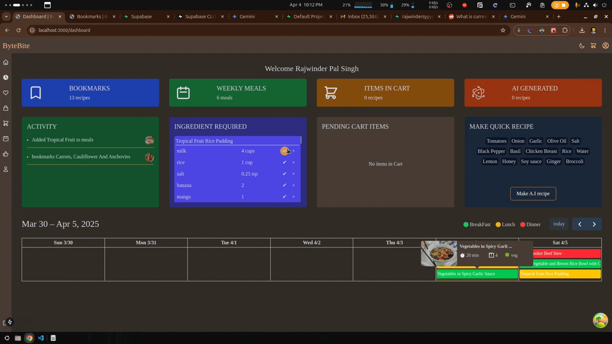
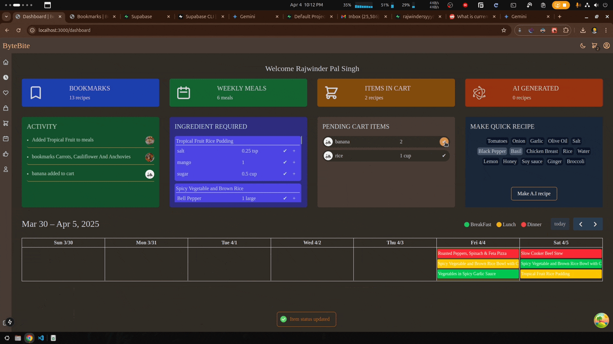
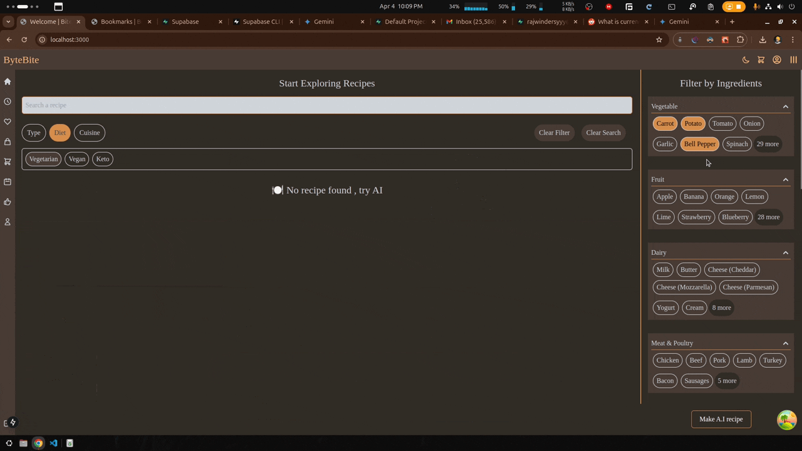
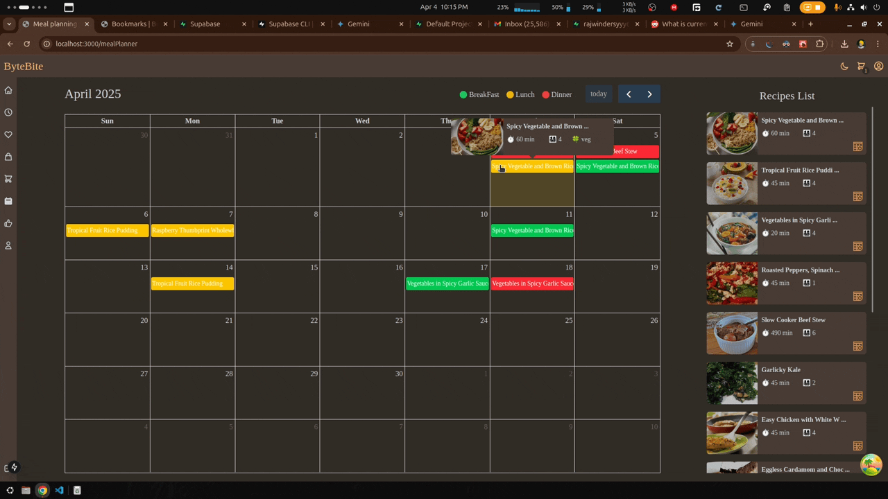

# 🍽️ ByteBites – AI-Powered Recipe Generator & Meal Planner

## 📌 Overview

ByteBites is an interactive AI-powered recipe generator and meal planner. Users can input ingredients they have at home, and the system generates recipes using AI. Additionally, users can save meals, plan their week, and generate shopping lists based on their selections. The system also recommends ingredients based on upcoming scheduled recipes.

## 🎨 Design & UX

- 🏡 **Minimalist, Rounded Modern UI:** A simple, flat design.
- 🎨 **Color Palette:** Warm and inviting food tones (🍊 orange, 🍃 green, 🍯 beige, 🍷 deep red).
- 🔠 **Typography:** Readable serif font.
- 🌙 **Dark Mode Toggle:** Switch between light and dark themes.

## 🖥️ Features

### 1. Recipe Explorer

- **Interactive Recipe Search:** Use filters such as type, diet, and more to refine searches.
- **Ingredient-Based Search:** Find recipes by entering specific ingredients.
- **AI-Generated Recipes:** Create custom recipes using AI based on selected ingredients.
- **Like and Bookmark Recipes:** Save favorite recipes for easy access.

### 2. Interactive Dashboard

The dashboard provides a comprehensive overview of user activity and key metrics, divided into three rows:

#### First Row

- **Bookmarks Card:** Displays the total number of bookmarked recipes.
- **Weekly Meals Card:** Shows the number of meals scheduled for the current week.
- **Cart Items Card:** Indicates the total number of items in the shopping cart.
- **AI-Generated Recipes Card:** Displays the total number of AI-generated recipes created by the user.

#### Middle Row

- **Activity Card:** Tracks recent user activities, such as bookmarked recipes, purchased ingredients, and scheduled meals.
- **Required Ingredients Card:** Recommends ingredients based on upcoming scheduled meals, with an option to add them to the shopping cart.
- **Pending Cart Items Card:** Provides quick actions to check purchased ingredients.
- **AI Recipe Card:** Allows users to quickly generate recipes by selecting tags.

#### Last Row

- **Calendar Card:** Displays recipes scheduled for the current week in a calendar view.

### 3. Weekly Meal Planner

- Plan and schedule meals by selecting specific dates and times.
- View meals on a calendar for easy visualization.
- Hover over calendar items for a quick recipe description.
- Click on a meal to remove it from the schedule.

### 4. Saved Recipes

- View a quick summary of a recipe, including its ingredients, by selecting a recipe card.
- Add recipes or individual ingredients directly to the shopping cart.

### 5. Liked Recipes

- View liked recipes along with a brief description of each.
- Use quick actions to remove recipes from the liked list or toggle their bookmark status.

### 6. Shopping Cart

- Add recipes and ingredients to a temporary shopping cart.
- Update or create a new shopping list, automatically merging duplicates and adjusting quantities.

### 7. Profile and Authentication

- Change username and profile picture.
- Update password.
- Simple credential-based login and signUp features.

### 8. Additional Features

- **Responsive Design:** Works well on most screen sizes.
- **Scalable and Maintainable:** Focused on scalability and ease of maintenance.
- **Lazy Loading:** Improves performance by loading images only when needed.
- **ToolTip** Add tooltip to show full name of recipe
- **Dark Mode** User can switch light and dark mode

## 🛠️ Technology Stack & Features

- ⚡ **Next.js:** Server-side rendering for fast loading.
- 🧠 **Gemani API:** AI-powered recipe text generation.
- 🧠 **Stable Diffusion API by Cloudflare:** AI-powered recipe image generation.
- 🍲 **Spoonacular API:** Fetch real-world recipes, ingredient details, and nutrition data.
- 🗄️ **Supabase:** Stores user data and recipes.
- 🔐 **NextAuth.js:** Authentication.
- ⚛️ **React Query:** Remote state management.

## Missing Features & Future Plans

- Google Login (via NextAuth.js).
- Password reset functionality.
- "Delete Account" button.
- Animations for smoother user experience.
- Drag-and-drop functionality for the meal planning calendar.
- Notifications and user feedback.
- Feedback form for reporting bugs.

## Screenshots and Demos

### Dashboard | Quick Actins



### Explore Recipes Feature



### Like Recipes



### Save Recipes


### Meal Planning (add ,remove meals plannings)



### Other features (darkMode , tooltip, floatingUI  )


## 🛠 Installation/Setup

1. Clone the repository:

```sh
git clone https://github.com/rajwindersxxx/bytebites.git
```

2.Install dependencies:

```sh
cd bitebytes
npm install
```

3.Add a `.env.local` file:

```sh
USE_API=true   # Set to false to use sample data (may cause DB mutation errors)
# External APIs
FOOD_API_KEY='Spoonacular API key'
GOOGLE_AI_API_KEY='Google Gemani API key'
CLOUDFLARE_ID='Cloudflare ID'
CLOUDFLARE_WORKER_KEY='Stable Diffusion API key'

# Supabase
SUPABASE_URL='Supabase URL'
SUPABASE_KEY='Supabase global key'

# Authentication
AUTH_SECRET='Random key'
NEXTAUTH_URL=http://localhost:3000
```

4.Set up your Supabase database:

- Execute `db.sql` on the Supabase database (tested on remote supabase).
- Use the Supabase key to connect to the database.

5.Finally, run the project:

```sh
npm run dev
```

- Access the project at [http://localhost:3000](http://localhost:3000).
- Demo Link: [https://bytebitesxxx.vercel.app](https://bytebitesxxx.vercel.app)
